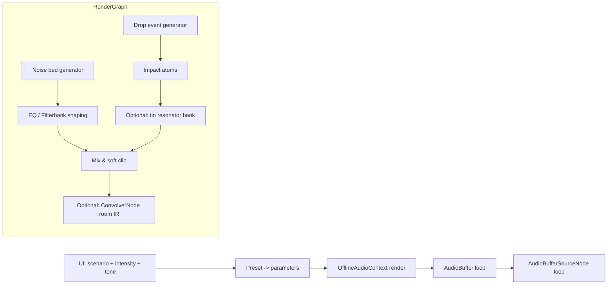

# Highly Realistic Rain Sound Design for a Web-Based Sleep-Sound App

## Executive summary

Highly realistic rain for headphones/speakers is best treated as an **auditory texture**: a dense cloud of micro-impacts whose *time-averaged* statistics stay fairly stable, while the microstructure remains unpredictable. Auditory texture research shows that realism is strongly tied to matching **subband envelope statistics** (energy, modulation depth/time-scale, and correlations), not just “making noise and filtering it.” citeturn4search23turn18view1turn18view0

For the two target scenarios, the main differentiator is **structural resonance**:

- **Rain on ground/floor (A)** is predominantly **broadband, short-lived impacts** plus a weak continuous bed (re-radiated splash/noise), with little narrowband ringing; realism comes from impact density, amplitude distribution, and correct spectral tilt. citeturn9view0turn19view2  
- **Rain on tin/metal roof (B)** is dominated by **raindrop impact forces exciting thin panels**, producing audible modal peaks (“ping”, “tink”, “ring”), with decay times and resonant frequencies shaped by panel mass, boundary conditions (fasteners/purlins), damping layers, and the room below. citeturn6view3turn6view2turn13view0

A practical, high-realism browser strategy is usually **hybrid**:

- Use a **procedural bed + stochastic impact atoms** (for continuous variety and intensity control), following proven “sound atom” decompositions for environmental textures. citeturn19view2turn17search9  
- For tin roofs, add **modal synthesis (resonator bank)** or **convolution with measured roof impulse responses** to reproduce recognisable metal ringing efficiently. citeturn19view2turn12search14turn12search2  
- Render **offline to a seamless loop** (or a small loop bank) with entity["organization","Mozilla","web platform org"]’s `OfflineAudioContext`, then play as a static buffer to minimise CPU/battery. citeturn0search8turn0search19

Open-ended assumptions (you can set these to your product constraints): target sample rate (44.1 vs 48 kHz), acceptable start-up render time (offline synthesis), maximum loop memory, and whether you need real-time parameter morphing or only occasional changes. citeturn12search7turn0search8

## Perceptual cues that make rain sound realistic

Realistic rain is less about “correct physics per drop” and more about **matching the perceptually relevant statistics** of a stationary texture.

Auditory texture synthesis work shows that many natural textures (including rain) are well characterised by statistics computed from an **auditory-inspired filterbank**: subband envelope moments, modulation statistics, and inter-band dependencies; matching these produces signals listeners often recognise as new exemplars of the original texture. citeturn4search23turn0search13turn18view0turn18view1

From a sound-design/engineering standpoint, the strongest realism cues for rain in sleep apps tend to be:

**Spectral envelope shaped by surface + listening position.**  
“White noise + a lowpass” usually fails because real rain beds are band-shaped, often with a mid/high emphasis and a controlled low end (unless there is room/roof boom). The “sound atoms” approach explicitly separates a background noise spectrum from discrete impacts and matches subband energies from recordings. citeturn19view2turn17search9

**Proper event statistics: density, amplitude distribution, and clustering.**  
Rain is made of overlapping micro-events; audible realism comes from a plausible distribution of “drop loudness” (many quiet, few loud) and non-uniform density (small bursts, lulls). Procedural rain systems commonly drive impacts stochastically and layer a background bed to stand in for the unresolvable mass of tiny drops. citeturn19view2turn9view0

**Frequency-dependent damping and material signature.**  
Impact-sound research emphasises that perceived material/geometry cues are strongly linked to frequency-dependent damping and emergence of resonances; modelling damping with time-varying or resonant filtering improves material realism compared with static filters. citeturn8search2turn8search5

**Stereo width and decorrelation (especially for headphones).**  
Pseudo-stereo (channel offsets, slow drift, decorrelated noise components) can strongly reduce “loop fatigue” and flatness. Patents for relaxation sound devices explicitly exploit phase/time offsets between channels and modulated noise to increase perceived depth and reduce repetition artefacts. citeturn18view3turn18view2

**Texture continuity (no obvious loop seam).**  
Perceived repetition is often driven by periodic modulations, repeated “hero drops”, or stable narrowband peaks. Practical systems combat this with long-enough loops, crossfades, multiple loop variants, or continuously varying parameters inside bounded ranges. The “loop vs sound-bite” scheme in relaxation-audio patents is essentially an early, product-focused form of “multiple exemplars + randomised scheduling” to hide repetition. citeturn18view2turn9view0

## Physical and acoustic mechanisms for ground vs tin-roof impacts

Both scenarios are driven by the same meteorological inputs—drop size distribution, impact velocity, and event rate—but they diverge in how impact energy is converted to sound.

**Drop size distribution and intensity.**  
A widely used simple model for raindrop size distribution in steady rain is the exponential form introduced by entity["people","J. S. Marshall","meteorologist"] and entity["people","W. M. Palmer","meteorologist"], linking rainfall rate to the expected counts of drops of different diameters. citeturn1search2turn6view3  
Building-acoustics rain-noise studies also treat intensity and the drop-size distribution as key drivers of indoor rain noise and note that mismatches between natural rain and laboratory simulators can affect measured/estimated noise. citeturn6view3turn1search1

**Scenario A: rain hitting a floor/ground.**  
For hard ground (e.g., concrete, stone, tile), each raindrop produces a brief force impulse and a **short, broadband acoustic event** dominated by the local splash/impact, with relatively little sustained ringing because the ground is effectively a high-mass, high-damping termination compared with thin plates. A physically motivated rain synthesis line of work focused on solid surfaces models rain as many such impacts, distributed randomly in time/space and summed (superposition). citeturn9view0turn19view2  
In practice for audio design, what matters is that the ground case wants **short transients + a shaped “hiss/bed”** rather than prominent pitched resonances. citeturn19view2turn18view1

**Scenario B: rain hitting a tin/metal roof.**  
Lightweight roofs behave like vibrating plates: raindrop impacts apply dynamic forces that excite bending-wave modes. The resulting vibration is radiated as sound and transmitted into the interior space. This mechanism—and its dependence on roof mass, damping, and mounting/boundary conditions—features centrally in building-acoustics rain-noise prediction and measurement work. citeturn6view2turn6view3turn13view0  
Engineering models of rain noise often focus on the building-acoustics frequency band (roughly 100–5000 Hz) and compute vibration velocity (including resonant components) arising from drop impacts on plates. citeturn6view2  
Laboratory and field work on lightweight roofs shows rain intensity is a decisive factor for heavy rains, and roof vibration/noise issues are particularly pronounced for low-mass roof constructions. citeturn6view3turn2search0

image_group{"layout":"carousel","aspect_ratio":"16:9","query":["rain hitting concrete ground close up","rain on pavement close up","rain on corrugated metal roof close up","tin roof rain exterior close up"],"num_per_query":1}

**Modal targets for “tin roof” timbre.**  
Tin/metal roofs often exhibit audible peaks in mid bands (hundreds of Hz to a few kHz) whose exact positions depend on panel construction; examples in roof-panel contexts show structural features (bounce modes, mass–spring effects, fastening/boundary conditions) producing distinct resonant regions that can dominate perceived noisiness indoors. citeturn13view0turn6view2  
For synthesis, this implies that “tin roof rain” should not be a single broadband noise: it should contain a **broadband patter** plus **sparse-to-dense excitations of resonant filters/modes**.

## Synthesis and processing approaches

The approaches below are presented as “design patterns” you can implement in a browser. For each, the parameter lists explicitly include what to expose for the two scenarios (ground vs tin roof), and what to keep internal.

### Approach group: recorded loops with procedural control

**Principle.**  
Use high-quality recordings for the base texture (ground rain and tin-roof rain separately), then add controlled DSP and stochastic layering to avoid repetition and provide intensity control.

**Algorithm sketch.**  
1. Maintain 2–4 loop layers per scenario (light/medium/heavy).  
2. Crossfade between adjacent intensity layers; add slow random EQ drift.  
3. Overlay a stochastic “near-drop” layer (procedural impacts or small recorded one-shots) for micro-variation.  
4. Optional: convolve with a room IR for “indoors” realism. citeturn12search14turn3search3

**Required parameters.**  
- Intensity control: target dB, crossfade time, layer gains.  
- Optional micro-variation: near-drop rate (events/s), near-drop amplitude distribution, stereo width.  
- Room: IR selection, wet/dry mix, pre-delay.

**Recommended filters/settings (starting points).**  
- Ground: high-pass around 80–250 Hz to avoid rumble; gentle high-shelf cut if harsh (to reduce fatigue).  
- Tin roof: preserve mid resonant bands (often 400 Hz–4 kHz), but control harshness with a gentle shelf above ~6–8 kHz.  
These settings are intentionally broad because roof/recording perspective dominates the true spectrum. citeturn13view0turn6view2turn19view2

**Layering strategy.**  
- Base loop (dominant).  
- Micro-impacts (quiet, randomised, wide stereo).  
- Optional resonant “ping” sweeteners for tin roof if recordings are too broadband.

**Spatialisation.**  
Simple and effective: decorrelated stereo + slow, sub-perceptual drift in inter-channel delay (milliseconds) to avoid static image. citeturn18view3turn18view2

**Looping and continuity.**  
Prefer multiple loop exemplars + randomised scheduling over a single loop. The “sound bite” idea—multiple versions of the same category and selection at run time—is a well-established consumer product tactic for avoiding perceived repetition. citeturn18view2

**Performance.**  
Very low CPU; main cost is decoding buffers and optional convolution (which can be heavy for long IRs). citeturn12search2turn12search17

---

### Approach group: procedural “auditory texture” rain using sound atoms

**Principle.**  
Model rain as a dense auditory texture with:  
- an equalised “background” (standing in for the huge number of unresolved drops), plus  
- stochastically triggered discrete impact atoms (for recognisable microstructure), including a **modal impact** atom for resonant surfaces (tin roof). citeturn19view2turn17search9

A particularly directly actionable formulation is the “five sound atoms” framework used for particle-based environmental effects, including explicit rain pseudo-code and atom equations. citeturn19view2turn17search9

**Algorithm/pseudocode (adapted to the two-scenario constraint).**
```text
processRain(frameRate):
  # 1) Background bed (represents many tiny drops)
  bed = equalisedNoise( subbands=K, targetSpectrum=EnvGround or EnvTin )

  # 2) Discrete impacts (audible drops)
  if rand() < rateGroundImpacts:   mix += noisyImpactAtom(paramsGround)
  if rand() < rateTinImpacts:      mix += modalImpactAtom(paramsTin)

  # 3) Tin roof only: reinforce ringing / structural modes
  if scenario == TIN_ROOF and rand() < rateTinRings:
       mix += resonatorPing(paramsTinRing)   # optional extra

  # 4) Spatialise (stereo decorrelation, random panning)
  L,R = spatialise(mix, width, decorrelation)

  return L,R
```
This corresponds closely to published rain pseudo-code where drop rates drive triggers, and a multiband equalised noise builds the bed. citeturn19view2

**Required parameters.**  
- **Drop statistics:** drop rate (events/s), drop-size proxy distribution (e.g., log-normal amplitude), clustering (“burstiness”).  
- **Ground transfer:** impact decay time (short), band emphasis (broadband/noisy).  
- **Tin transfer:** modal frequencies `{f_m}`, decays `{α_m}` or Qs `{Q_m}`, per-mode gains `{a_m}`. The published modal impact form uses sums of damped sinusoids with material-dependent decay. citeturn19view2turn8search2  
- **Bed spectrum:** target subband energies (learned from a recording or hand-designed). The atom framework explicitly estimates subband energies from a sample by filtering into ERB bands and time-averaging energy. citeturn19view2  
- **Stereo:** width, per-impact pan distribution, and a decorrelation method.

**Recommended filter types/settings.**  
- Bed: multiband equalisation (filterbank or stacked biquads) to match a target spectrum; this is the “make it not white noise” core. citeturn19view2turn18view0  
- Ground impacts: band-limited noise burst (e.g., biquad bandpass 1–8 kHz with low Q) with 5–30 ms decay.  
- Tin impacts: route excitations into a resonator bank (multiple bandpass/peaking filters with moderate-to-high Q).

**Layering strategy.**  
Keep discrete drops quieter than you think; the bed should dominate at medium/heavy intensity, while impacts provide the recognisable “patter”. This matches why the atom framework uses an equalised noise atom for huge numbers of simultaneous drops “at low computational cost.” citeturn19view2

**Spatialisation.**  
- Stereo: random pan per drop + small random inter-channel delay (0–2 ms) + mild mid/side widening is often sufficient.  
- Ambisonic/binaural (optional): route impacts as point sources; bed as diffuse field. A published atom-based system discusses both point-like collections and plane-wave diffuse sources for environmental textures. citeturn19view2turn3search1turn3search10

**Looping/continuity.**  
Because the event process is stochastic, you can generate long, non-repeating buffers offline. If you must loop short buffers, use crossfaded loop boundaries and ensure your random generator state does not repeat at the loop period.

**Performance.**  
Computational cost scales mainly with: impacts per second × (filters per impact). The atom framework explicitly uses the equalised noise bed to avoid simulating every drop. citeturn19view2turn17search9

---

### Approach group: physically based, material-aware statistical rain

**Principle.**  
Use a physically grounded separation between impact mechanism and material response, then accelerate synthesis by clustering/sampling: precompute a **basic rain sound bank** and add **material sound textures** to differentiate surfaces (including metal). citeturn20view1turn20view3

A notable example constructs a bank of clustered rain sounds for liquid vs solid surfaces, then activates sources on a grid near the listener to cut cost. citeturn20view1turn20view0

**Algorithm sketch (browser-adaptable).**  
1. Offline/preprocess: generate or curate a small bank of “rain blocks” indexed by intensity bin and distance, separately for solid surfaces. citeturn20view1turn19view1  
2. At run time: choose which bank element(s) to play based on intensity and scenario, then blend in a metal-specific “shader” layer (a filtered resonant texture or a short “tin roof resonance” IR). citeturn20view1turn20view3  
3. Spatialise with simple distance-based attenuation and stereo panning (or binaural if desired).

**Required parameters.**  
- Intensity bins and mapping from user “light/medium/heavy” to a physical proxy (e.g., drop count or mm/h). citeturn6view3turn1search2  
- Material-specific shaping: metal vs ground EQ/transfer; for metal, additional resonant emphasis.

**Performance notes relevant to web.**  
Bank-based approaches can become memory heavy: a published implementation reports ~200 basic rain sounds totalling ~100 MB and non-trivial precompute time, which is a warning sign for browser delivery unless you reduce bank size dramatically or generate locally. citeturn20view1turn19view0

---

### Tin roof–specific: modal resonance modelling vs convolution

This is the most important “B scenario” decision.

**Option B1: modal synthesis / resonator bank (procedural ringing).**  
Tin-roof timbre behaves like an excitation into a resonance system. Modal synthesis literature and impact-sound models commonly represent objects as sums of damped resonances driven by an excitation; this maps well to a roof panel approximation. citeturn2search28turn2search24turn8search2  
In building acoustics terms, rain noise arises from drop impacts exciting roof-panel modes, with modal frequencies affected by mass, boundary conditions, and damping. citeturn13view0turn6view2

Practical approximation (good enough for a sleep app): select 8–20 resonant bands with randomised centre frequencies within plausible ranges, update slowly over minutes, and excite them with filtered noise bursts.

**Option B2: convolution with measured roof IRs (data-driven ringing).**  
Convolution captures the “tin character” extremely well if you have a good IR of “single drop on tin roof” or “tap on roof panel” recorded in your target configuration. Web Audio supports convolution directly, and the spec notes typical stereo convolution uses separate left/right IRs. citeturn12search14turn12search2  
Practical constraints: setting long IR buffers can be expensive and may cause stalls; browser implementation and thread behaviour have been discussed in Web Audio issue tracking. citeturn12search17

A hybrid often works best: short convolution IR (for the “tink”) + light modal bank (for sustained ringing) + room reverb IR (for interior feel). citeturn12search14turn13view0

## Web Audio API implementation blueprint

This section focuses on concrete browser implementation patterns that match your sleep-app constraints (low CPU, stable playback, optional live control).

**Audio block sizes and why they matter.**  
- Web Audio’s default render quantum is 128 frames. citeturn12search7turn12search5  
- `AudioWorkletProcessor.process()` currently receives blocks of 128 frames; you must not hardcode assumptions, but it is the current behaviour and is documented. citeturn12search5turn12search13  
- If you need larger processing windows (e.g., 512/1024) for FFT/filterbanks, the recommended pattern is an internal ring buffer accumulating 128-frame blocks. citeturn12search9turn12search0

**Offline rendering for sleep apps.**  
`OfflineAudioContext` renders an AudioNode graph “as fast as it can” into an `AudioBuffer`, enabling low-runtime CPU playback (you render once, then loop). citeturn0search8turn0search19

**Recommended architectural flow (offline-first).**

This flow matches published approaches that (i) build beds and impacts separately, (ii) add resonant atoms for metal surfaces, and (iii) optionally incorporate spatial/room processing. citeturn19view2turn12search14turn9view0

**Core Web Audio node suggestions (minimum viable, high quality).**  
- Bed: custom generator (AudioWorklet or buffer noise) → `BiquadFilterNode` chain (HP/LP/shelves). citeturn12search7turn0search15  
- Impacts: `AudioBufferSourceNode` one-shots (precomputed impact atoms) *or* AudioWorklet-generated bursts.  
- Tin resonance:  
  - simplest: a parallel bank of `BiquadFilterNode` bandpasses/peaking filters, summed;  
  - best CPU: implement the resonator bank inside an AudioWorklet (one pass, N biquad sections). citeturn12search5turn8search2  
- Room: `ConvolverNode` with a short IR; remember the IR buffer must match the context sample rate. citeturn12search28turn12search2

**Short JS sketch: offline render to a loopable buffer and make a Blob URL.**
```js
async function renderRainLoopToBlob({ durationSec = 30, sampleRate = 48000 } = {}) {
  const length = Math.floor(durationSec * sampleRate);
  const ctx = new OfflineAudioContext(2, length, sampleRate);

  // TODO: connect your graph here (bed + impacts + tin resonators + optional convolver)
  // Example placeholders:
  const gain = new GainNode(ctx, { gain: 0.8 });
  gain.connect(ctx.destination);

  // Render
  const audioBuffer = await ctx.startRendering();

  // Encode 16-bit PCM WAV
  const wav = encodeWav16(audioBuffer);
  return URL.createObjectURL(new Blob([wav], { type: "audio/wav" }));
}

function encodeWav16(audioBuffer) {
  const numCh = audioBuffer.numberOfChannels;
  const sampleRate = audioBuffer.sampleRate;
  const numFrames = audioBuffer.length;

  // Interleave
  const channels = Array.from({ length: numCh }, (_, i) => audioBuffer.getChannelData(i));
  const interleaved = new Float32Array(numFrames * numCh);
  for (let i = 0; i < numFrames; i++) {
    for (let ch = 0; ch < numCh; ch++) interleaved[i * numCh + ch] = channels[ch][i];
  }

  // WAV header + PCM16 data
  const bytesPerSample = 2;
  const blockAlign = numCh * bytesPerSample;
  const byteRate = sampleRate * blockAlign;
  const dataSize = interleaved.length * bytesPerSample;

  const buffer = new ArrayBuffer(44 + dataSize);
  const view = new DataView(buffer);

  // RIFF
  writeAscii(view, 0, "RIFF");
  view.setUint32(4, 36 + dataSize, true);
  writeAscii(view, 8, "WAVE");
  // fmt
  writeAscii(view, 12, "fmt ");
  view.setUint32(16, 16, true);          // PCM chunk size
  view.setUint16(20, 1, true);           // PCM format
  view.setUint16(22, numCh, true);
  view.setUint32(24, sampleRate, true);
  view.setUint32(28, byteRate, true);
  view.setUint16(32, blockAlign, true);
  view.setUint16(34, 16, true);          // bits per sample
  // data
  writeAscii(view, 36, "data");
  view.setUint32(40, dataSize, true);

  // PCM samples
  let offset = 44;
  for (let i = 0; i < interleaved.length; i++) {
    let x = Math.max(-1, Math.min(1, interleaved[i]));
    // optional soft clip could be applied earlier in the DSP chain
    view.setInt16(offset, Math.round(x * 32767), true);
    offset += 2;
  }
  return buffer;
}

function writeAscii(view, offset, str) {
  for (let i = 0; i < str.length; i++) view.setUint8(offset + i, str.charCodeAt(i));
}
```
Use `OfflineAudioContext` when you can tolerate a short precompute step; it is explicitly designed to output audio buffers without playing to hardware. citeturn0search8turn0search19

**Browser performance and stability notes.**  
- Avoid `ScriptProcessorNode` for new work; it is deprecated, and its main-thread scheduling can create glitches. citeturn12search1turn12search16turn12search30  
- If you set or swap long convolution IR buffers at runtime, budget for potential stalls and consider preloading or using shorter IRs. citeturn12search17turn12search2  
- If you need binaural/ambisonic spatialisation: consider entity["company","Google","tech company"]’s open-source web spatial audio stacks (ambisonic decoding and Web SDKs), but weigh the CPU and your “sleep app” needs carefully. citeturn3search1turn3search10turn3search33

## Comparative tables and parameter presets

### Comparison of practical approaches for browser rain

| Approach | Realism ceiling | Implementation complexity | Runtime CPU | Memory | Best fit |
|---|---:|---:|---:|---:|---|
| Recorded loops + crossfades + subtle DSP | Very high (if recordings great) | Low–Medium | Low | Medium | Fastest to ship; lowest risk |
| Sound-atom procedural (bed + stochastic impact atoms) | High | Medium | Medium | Low | Most controllable without big assets citeturn19view2turn17search9 |
| Bank-based “basic rain sounds” + lightweight modification | High | Medium–High | Low–Medium | Low–Medium | When you want small asset bank but variety citeturn19view0 |
| Tin roof via modal resonator bank (procedural) | High for metal “ring” | Medium–High | Medium | Low | When you need adjustable roof character citeturn6view2turn13view0turn8search2 |
| Tin roof via convolution with measured “drop IR” | Very high (if IR well captured) | Medium | Medium | Medium | When you can measure/ship IRs citeturn12search14turn12search2turn12search28 |

### Schematic frequency-profile cues

Below is a **schematic** (not a measured spectrum) to guide EQ/resonator choices:

```text
Frequency bands (Hz):   50   100   250   500   1k   2k   4k   8k   12k

Ground rain (A):        --    -     o     o    O    O    O    o     -
Tin roof rain (B):      --    o     O    [PEAK] O  [PEAK] o    o     -
Legend: -- very low, - low, o moderate, O high, [PEAK] narrowband resonant emphasis
```

The mid-band peaking for lightweight roof structures is consistent with published roof-panel discussions where resonance regions can dominate indoors and depend on construction/boundary conditions. citeturn13view0turn6view2

### Recommended starter presets

These are **engineering presets** (starting points). Tune by ear using a spectrum analyser and long listening tests to avoid fatigue, then calibrate for your target playback devices.

| Scenario | Intensity | Bed level | Discrete impact rate | Impact decay | Tin resonances |
|---|---|---:|---:|---:|---|
| Ground (A) | Light | 0.35 | 8–15 /s | 8–15 ms | None |
| Ground (A) | Medium | 0.55 | 20–40 /s | 6–12 ms | None |
| Ground (A) | Heavy | 0.75 | 50–90 /s | 4–10 ms | None |
| Tin roof (B) | Light | 0.30 | 6–12 /s | 6–12 ms | 6–10 modes, Q 8–20, decay 80–180 ms |
| Tin roof (B) | Medium | 0.50 | 15–35 /s | 5–10 ms | 10–16 modes, Q 10–30, decay 120–260 ms |
| Tin roof (B) | Heavy | 0.70 | 35–70 /s | 4–8 ms | 14–22 modes, Q 12–40, decay 150–350 ms |

Rationale: the atom-based approach uses a bed to represent huge numbers of simultaneous drops, with discrete impacts providing microstructure; this table follows that separation and adds a modal component to represent ringing resonant surfaces. citeturn19view2turn13view0

**Tin roof variants (suggested mode bands).**

| Variant | Add modes in these regions | Perceptual goal |
|---|---|---|
| “Small drops / pitter” | 1.2–4 kHz (more modes, slightly higher Q) | brighter, lighter “tink” |
| “Large drops / clatter” | 200–900 Hz + 900–2 kHz (stronger low-mid, lower Q) | heavier thuds + metallic bloom |
| “Damped roof / insulated” | reduce Q, shorten decay; reduce 1–4 kHz peaks | less intrusive, more “softened” interior |

These map to the idea that roof modal response depends on mass/damping and that lower modes need higher input energy, becoming more audible with heavier rain. citeturn13view0turn6view2turn6view3

## Key academic papers, standards, patents, and implementations

The sources below are prioritised for primary/official documentation and directly actionable details.

**Auditory texture perception and synthesis foundations.**  
- “Sound texture perception via statistics…” (open full text) establishes auditory texture stationarity and a statistics-based synthesis approach applicable to rain. citeturn4search23turn0search13turn18view1  
- A detailed thesis on statistical models of natural sounds identifies subband energy, sparsity, modulation depth/time-scale, and inter-band dependencies as critical statistics for realistic textures. citeturn18view0

**Procedural rain synthesis models with explicit algorithms.**  
- A “sound atoms” environmental synthesiser paper includes explicit rain equations (chirped/noisy/modal impacts, equalised noise bed) and pseudo-code suitable for direct implementation. citeturn19view2turn17search9  
- A physically based, material-aware statistical approach reports a clustered “basic rain sound bank,” activation schemes, and performance/memory trade-offs relevant to web feasibility. citeturn20view1turn20view3turn19view1  
- A lightweight, scene-aware synthesis method uses a small set of basic rain sounds and frequency-domain extension/concatenation to reduce memory budgets, with an architecture diagram you can adapt. citeturn19view0  
- A physically motivated real-time synthesis paper emphasises stochastic distribution of impacts, superposition, and parameter control (drop volume, speed, intensity). citeturn9view0

**Tin roof / lightweight roof acoustics and measurement standards.**  
- Consolidated engineering theory for predicting rain noise from drop impact on plates (emphasising 100–5000 Hz region) and discussion of force/impedance factors. citeturn6view2  
- Laboratory measurement standard for rainfall-generated sound on building elements (useful for understanding what “roof rain noise” measurements target). citeturn1search1turn1search9  
- Experimental roof studies relating natural/artificial rain noise and key deviations (intensity, fall height, drop-size distribution). citeturn6view3  
- Conference paper focused on metal-roof rain noise highlights mode excitation mechanisms and practical test considerations. citeturn13view0

**Impact sound and resonance modelling for “tin” character.**  
- Impact-sound synthesis via dynamic filtering and modal contributions (useful for designing material-dependent damping). citeturn8search2turn8search5  
- Modal synthesis and physically based collision sound work provides efficient resonance-bank patterns and performance discussion. citeturn2search28turn2search24turn2search2turn2search9

**Web Audio API core references and practical performance.**  
- Official Web Audio spec (render quantum defaults, graph model). citeturn0search15turn12search7  
- `OfflineAudioContext` reference and examples (offline rendering to buffers). citeturn0search8turn0search19  
- `AudioWorkletProcessor.process()` block sizing and guidance. citeturn12search5turn12search13  
- Deprecation of `ScriptProcessorNode` and motivation for AudioWorklet. citeturn12search1turn12search16  
- Convolution architecture discussion and `ConvolverNode` usage constraints (including sample-rate matching). citeturn12search14turn12search28turn12search2

**Spatialisation and impulse-response resources (optional for sleep apps).**  
- Ambisonic/binaural decoding in Web Audio (`Omnitone`) and web spatial audio SDKs. citeturn3search1turn3search10  
- Open impulse response library (`OpenAIR`) for room reverbs and spatial formats. citeturn3search3turn3search11

**Patents with practical “anti-repetition / pseudo-stereo” ideas.**  
- Relaxation audio system distinguishing loop-format continuous sounds vs “sound bite” sporadic sounds; includes memory/structure considerations aimed at reducing perceived repetition. citeturn18view2  
- Enhanced sound generator describing stereo depth via timing offsets and dual noise generators (relevant to pseudo-stereo rain beds). citeturn18view3